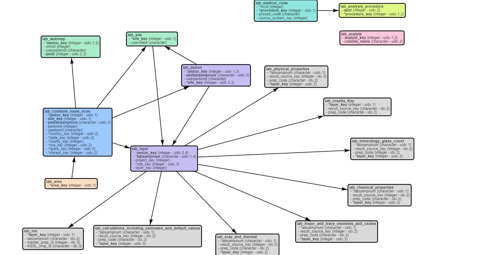

```{r setup, echo=FALSE, results='hide', warning=FALSE}
library(knitr, quietly=TRUE)
library(kableExtra, quietly = TRUE)
library(soilDB, quietly = TRUE)
library(DT, quietly = TRUE)

opts_chunk$set(
  message = FALSE, 
  warning = FALSE, 
  background = '#F7F7F7', 
  fig.align = 'center', 
  dev = 'svglite', 
  fig.ext = ".svg", 
  tidy = FALSE, 
  verbose = FALSE
)

options(width=100, stringsAsFactors=FALSE)
```

# Introduction


# Setup


```{r eval = FALSE}
install.packages('soilDB')
install.packages('aqp')
install.packages('mapview')
install.packages('sf')
install.packages('soiltexture')
install.packages('scales')
install.packages('Hmisc')
```


# Tables / Keys

Open in a new browser tab for a larger version. [Interactive version](https://jneme910.github.io/Lab_Data_Mart_Documentation/Documents/SDA_KSSL_Data_model.html).


## Table Descriptions

```{r echo = FALSE}
td <- read.csv('metadata/NCSS Table Description.csv')

kable_styling(
  kable(
    td, 
    row.names = FALSE, 
    col.names = c('Table', 'Description'),
    caption = ""),
  font_size = 10
)
```

## Column Descriptions

```{r echo = FALSE}
cd <- read.csv('metadata/NCSS Columns Description.csv')

formatStyle(
  datatable(cd), columns = 1:ncol(cd), fontSize = '75%'
)
```


```{r echo = FALSE, eval = FALSE}
kable_styling(
  kable(
    SDA_query("SELECT TOP 1 * FROM lab_area WHERE area_type = 'ssa' ;"),
    row.names = FALSE
  ), full_width = TRUE, font_size = 10
)
```


# Sequoia-Kings Canyon (CA792)

## Site/Pedon Data
Load required libraries
```{r}
library(soilDB)
library(aqp)
```


```{r}
sql <- "
SELECT
pedon_key, pedlabsampnum, pedoniid, upedonid, longitude_decimal_degrees, latitude_decimal_degrees,
area_code
FROM
lab_combine_nasis_ncss
JOIN
lab_area ON area_key = ssa_key AND area_type = 'ssa'
WHERE area_code = 'CA792'
;"

pedons <- SDA_query(sql)
nrow(pedons)
head(pedons)
```


### Pedon Locations
```{r}
library(mapview)
library(sf)

pedons.sf <- st_as_sf(pedons, coords = c('longitude_decimal_degrees', 'latitude_decimal_degrees'), crs = 4326)
mapview(pedons.sf)
```


## Layer / Physical / Chemical Properties

  * lab_pedon -> lab_layer [pedon_key]
  * lab_layer -> lab_physical_properties [labsampnum]


```{r}
# make a quoted vector of pedon keys, for use in the next query
pedon.keys <- format_SQL_in_statement(pedons$pedon_key)


## CA792 layer + physical properties
sql <- sprintf("
SELECT
l.pedon_key, l.labsampnum, hzn_top, hzn_bot, hzn_desgn,
sand_total, silt_total, clay_total, particle_size_method,
ph_h2o
FROM
lab_layer AS l
JOIN lab_physical_properties AS p ON l.labsampnum = p.labsampnum
JOIN lab_chemical_properties AS c ON l.labsampnum = c.labsampnum
WHERE l.pedon_key IN %s
ORDER BY l.pedon_key, hzn_top
;", pedon.keys)

hz <- SDA_query(sql)
nrow(hz)
head(hz)

# unique set of methods
table(hz$particle_size_method)
```


## Investigate Soil Texture
```{r fig.width=8, fig.height=8}
# remove missing values
ssc <- na.omit(hz[, c('sand_total', 'silt_total', 'clay_total')])

# re-name columns, required by textureTriangleSummary()
names(ssc) <- c('SAND', 'SILT', 'CLAY')

textureTriangleSummary(ssc, cex = 0.5)
```

## Profile Sketches
```{r fig.width=12, fig.height=6}
# make a copy and
# init SoilProfileCollection
x <- hz

depths(x) <- pedon_key ~ hzn_top + hzn_bot
hzdesgnname(x) <- 'hzn_desgn'

par(mar = c(0, 0, 3, 0))
plotSPC(x, print.id = FALSE, name.style = 'center-center', width = 0.3, color = 'ph_h2o', cex.depth.axis = 0.85, axis.line.offset = -4)
```

## Join Pedon + Horizon Data


# Bx Horizons
```{r fig.width=8, fig.height=8}
library(soiltexture)
library(scales)

# SDA Interface, this requires a network connection but otherwise it just WORKS!
qq <- "SELECT
hzn_top, hzn_bot, hzn_desgn, sand_total AS sand, silt_total AS silt, clay_total AS clay
FROM lab_layer
JOIN lab_physical_properties ON lab_layer.labsampnum = lab_physical_properties.labsampnum
WHERE hzn_desgn LIKE 'B%x%' ;"

# run query
bx <- SDA_query(qq)

##
## summarize sand, silt, clay for Bx horizons  
##

# number of records
nrow(bx)

# preview data
head(bx)


# extract components of texture, removing rows with missing data
ssc <- bx[, c('sand', 'silt', 'clay')]
ssc <- na.omit(ssc)

# adjust names for plotting with TT.plot()
# names must be SAND, SILT, CLAY
names(ssc) <- toupper(names(ssc))

# test of bogus data
ssc$sum <- rowSums(ssc[, c('SAND', 'SILT', 'CLAY')])
# > 5% deviation from 100%
idx <- which(abs(ssc$sum - 100) > 5)

# check errors: just one
ssc[idx, ]


# plot data
# note that there are many arguments used to adjust style
TT.plot(
  class.sys= "USDA-NCSS.TT",    # use "our" texture triangle
  tri.data=ssc,                 # data.frame with sand, silt, clay values
  main= "Bx Horizons",          # title
  tri.sum.tst=FALSE,            # do not test for exact sum(sand, silt, clay) == 100
  cex.lab=0.75,                 # scaling of label text
  cex.axis=0.75,                # scaling of axis
  cex=0.5,                      # scaling of point symbols
  col=alpha('royalblue', 0.125),  # color of point symbols, with transparency
  frame.bg.col='white',         # background color
  class.lab.col='black',        # color for texture class labels
  lwd.axis=1.5,                    # line thickness for axis
  arrows.show=TRUE
)

```


----------------------------
This document is based on `aqp` version `r utils::packageDescription("aqp", field="Version")` and `soilDB` version `r utils::packageDescription("soilDB", field="Version")`.

