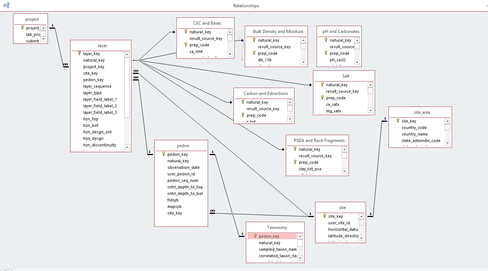

# 2019-03-12 Meeting Notes

## Members present:

 * Jason Nemecek
 * Jay Skovlin
 * Dylan Beaudette
 * Henry Ferguson
 * Adolfo Diaz
 * Scarlet Bailey

## Agenda
  
  * update from Jason on the [newly minted tables](https://nrcs.app.box.com/s/83s5zzokvitx5bwrha5hif57a7auka78), based on revised queries originally designed by Henry
  * discuss SQLite container for the data
  * testing of the data, NULL values, missing records, etc.
  * metadata, required for future use in NASIS / SDA

### Newly Posted Data 

  * The [table definitions for all of the new tables](https://github.com/ncss-tech/lab-data-delivery/tree/master/code/snapshot-preparation/schema), as defined in the SQLite container. Note that there are some errors in here where numeric fields have been downgraded to `TEXT` due to parse errors or data problems.
  
  * The [errors encountered while loading each of the new tables](https://github.com/ncss-tech/lab-data-delivery/tree/master/code/snapshot-preparation/parse-errors). I think that only the `layer` table had errors.
  
  * [KSSL snapshot, SQLite format](https://new.cloudvault.usda.gov/index.php/s/eSoPYbWDBQNX2HP)
  
  * [Re-organized notes](https://github.com/ncss-tech/lab-data-delivery/tree/master/notes).

Previous table relationships, c/o Jay.

## Discussion Points / Questions

 1. How and when are "calculations" applied to the source data? It seems that there are some data that should have records in the new `calculations` table but do not (e.g. `labsampnum = 'UCD03792'`).
 
 2. What is the ideal distribution model: periodic snapshot (like SSURGO but more frequent) or continuous via some form of synchronization?
 
 3. How do we get MLRA and RO staff "credit" for performing the much-needed pedon QC, so that we can progressively publish more than just lab pedons?
 
 4. What can we do to ensure that the pedon data download tools are used appropriately?
 
 5. What is the most robust method for keeping track of [methods/procedures](https://github.com/ncss-tech/lab-data-delivery/tree/master/metadata)? These are currently hand-edited XLSX/CSV files that have been imported into the new SQLite container.
 
 6. What is the preferred method for "fixing" data assigned an incorrect preparation or method code?
 
 7. Ideal naming conventions for keys used to link tables:
    * `upedonid`: user pedon ID, helpful for links to NASIS, paper copies, photos, field notes, etc.
    * `pedon_key`: LDM-specific (?) ID for sampled pedons
    * `layer_key` &harr; `result_source_key`: LDM-specific (?) link between physical samples and analytical values
    * `natural_key` &harr; `labsampnum`: LDM/NASIS, links physical samples, analytical values, and NASIS horizon records
    * `pedlabsampnum`: LDM/NASIS, links pedon records between two databases
    * `pedoniid`: NASIS, unique record ID for pedon objects
 
 8. Data distribution **vision**: what is the big picture?
 
 Perhaps something like  this?
 
 

## TODO

### Critical

  1. review the latest [KSSL snapshot, SQLite format](https://new.cloudvault.usda.gov/index.php/s/eSoPYbWDBQNX2HP), specifically:
     * NULLs
     * datatypes
     * missing values
     * [problems with method codes](https://github.com/dylanbeaudette/process-kssl-snapshot/issues/2)
     * [problems with prep codes](https://github.com/dylanbeaudette/process-kssl-snapshot/issues/2)
  
  
  2. write/review [draft tutorial on R-interface to SQLite DB](https://github.com/ncss-tech/lab-data-delivery/blob/master/manual/KSSL-snapshot-tutorial.R)
  
  3. basic metadata for incorporation into NASIS data model repository (?), this ensures that bare-bones documentation is automatic and Ft. Collins staff can "make" the required tables for future distribution
  
  4. document **correct** linkages between tables
 
 
### Long-Term

  * `COLEws` seems to be missing in the latest version of the snapshot
  * add `layer`, `rosetta`, `methods`, `procedures` [done]
  * errors in `result` table that [confound parsing](https://github.com/ncss-tech/lab-data-delivery/issues/14) of TXT export
  * ODBC drivers for SQLite?
  * simple interface to SQLite (I asked Chad about getting something certified)
  * pedon QC process / credit so that we can publish more than "lab" pedons
  * work with Scarlett to fix vs. clean-up errors in LDM
  * unification of IDs: e.g. change `natural_key` &rarr; `llabsampnum` globally, does this make sense?

